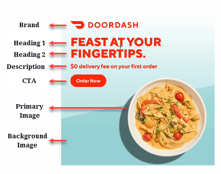
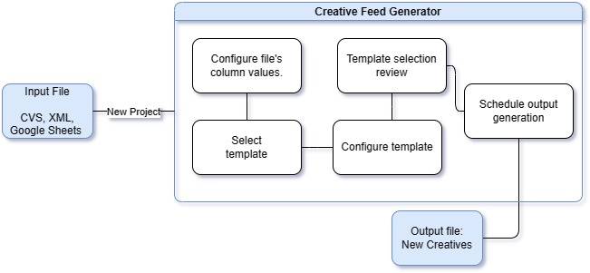

The Creative Feed Generator is an AI-powered tool that enables the creation of ad creatives in bulk. These ad creatives consist of images that are used in ad managers across various platforms. With the Creative Feed Generator, users can generate custom ad creatives that include primary images, text, background colors, prices, and more.

## The Create Feed Workflow

The Creative Feed Generator follows a well-defined workflow to generate ad creatives based on [input file]() you add while [creating a new project](). Here is an overview of the workflow:

### Configure input file 

The first step is to upload and configure the input file. Users can review the columns and assign user-friendly names to each column, ensuring the data is customized according to their preferences. To learn more, see [Create New Project](CFG/create_new_project.md).

### Select template 

Next, users can choose from a range of existing templates or request a tailor-made template. Tailoring the template allows users to align the output creatives seamlessly with their brand requirements. Users have the option to provide specific details or upload reference images to guide the template creation. To learn more, see [Select templates](CFG/templates.md).

### Configure template

Once the template is selected, users can configure the template by defining text and images for each layer. This step provides flexibility in adjusting configurations to meet specific preferences. Users can preview the changes made to the template before proceeding. To learn more, see [Configure Template](CFG/configure_template.md).

### Template selection review 

After configuring the template, users can generate a preview of the output creatives. This preview allows users to review the results and eliminate any undesired outputs, ensuring the final output meets their expectations. To learn more, see [Template Selection Review](CFG/template_review.md).

### Schedule run & output configuration

The Creative Feed Generator provides scheduling options for generating the output creatives. Users can choose between one-time runs or recurring runs based on their preferences. This flexibility enables seamless integration with ads managers and offers control over content delivery. To learn more, see [Schedule run & output configuration](CFG/output_file_configuration.md).

### Output file

Once the feed generation process is completed, users can access the output file. The output file contains the generated ad creatives, ready for use in ads managers. Users can preview the output and make any necessary adjustments before utilizing the creatives in their ad campaigns.

